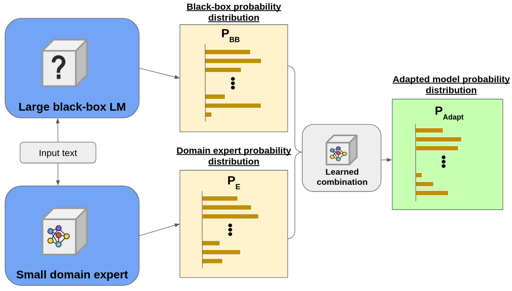

# CombLM: Adapting Black-Box Language Models through Small Fine-Tuned Models

**Aitor Ormazabal, Mikel Artetxe, Eneko Agirre**

This repository contains code for the system described in our EMNLP 2023  .

## Architecture

Our approach aims to adapt a black-box LLM by combining it with a smaller domain expert model. For this, we follow a two-step approach:

1. First, we train a domain expert model by fine-tuning a small(er) model on our target domain or task. 
2. Second, we **learn a combination function** that combines the small model with the large LLM at the probability level, on a small fitting set.

We implement the combined model as a hugginface model, which once fitted can be used as a drop-in replacement with any of the hugginface methods (`generate` etc.) 




## Install

Cloning the repository:

```
git clone https://github.com/aitorormazabal/CombLM
cd CombLM
```

Creating a virtual environment with the requirements:

```
python -m venv .env
source .env/bin/activate
pip install -r requirements.txt
```

## Usage 

Our experimentation was carried out on the OPT family of models for research purposes, and thus the huggingface implementation for the model combination is done for OPT models. You can take a look at `src/models/combined_model.py` if you want to extend the combination to other model families.

**Cache path**
Whenever a forward pass of a model is done through the fitting set, the computed logprobs are stored in a cache for quicker experimentation (i.e. in case you want to try fitting multiple different combination functions on the same models and fitting set, you don't need to run the forward pass through the large model every time). Edit `COMBLM_DIR` in `src/models/combined_model.py` to whatever you want to set the cache directory. 


We provide examples of applying CombLM for domain adaptation and machine translation on two toy datasets (10k document subsets of enron emails and wmt21 datasets). We use slurm scripts, simply replace `sbatch` with `sh` in case you have direct access to GPUs. 
### Domain adaptation to e-mails
You will need to edit $COMBLM_DIR in all the scripts to your CombLM path. 

Preprocess the dataset

```
sbatch data_scripts/prepare_enron.sh
```
This will use `src/datasets/prepare_dataset.py` and `src/datasets/split_valid_into_valid_test.py` to tokenize the dataset, chunk it into 1024 token sequences, and split it into train-valid1-valid2-test splits (test is unused, we fit the combinations in valid1 and test them on valid2). 

Fine-tune a small(er) OPT-1.3B on the train split:

```
sbatch train_scripts/ft_opt1.3_enron10k_2gpu.slurm
```
This will do a tiny fine-tune of the model for 100 steps, and save it to `models/opt-1.3b-enron'

Fit a `entropy-scalar` combination function on the valid1 sample:

```
sbatch train_scripts/fit_enron_entropy.sh
```

Now we can evaluate the combined model on the valid2 dataset:

```
sbatch eval_scripts/get_enron_entropy_logprobs.sh
```

This will save the logprobs over the validation sample of both models and the combined model in `result_logprobs/enron_entropy`.

Now you can compare the perplexities:

```
python3 src/eval/compare_ppl.py --logprobs_path result_logprobs/enron_entropy/validation2/
#Output
Model 1 PPL: 4.209706783294678
Model 2 PPL: 3.675647497177124
Combined model PPL: 3.3830063343048096
```
Model 1 is OPT-30B here, and Model 2 is the fine-tuned OPT-1.3B. 

### Machine translation
You will need to edit $COMBLM_DIR in all the scripts to your CombLM path. 

Training and fitting is the same as in the domain adaptation case. The data in `data/wmt21_10k/` is already 5-shot verbalized.

```
sbatch data_scripts/prepare_wmt21.sh
sbatch train_scripts/ft_opt1.3_wmt21_2gpu.slurm
sbatch train_scripts/fit_wmt21_entropy.sh
```
After fitting you can use the `src/eval/eval_combined_translation.py` script to generate translations:
```
sbatch eval_scripts/translate_encs_greedy.sh
```
Eval sacrebleu on toy test data for cs-en:
```
sacrebleu data/wmt21_10k/cs-en_test.tgt -i result_translation/wmt21_csen_greedy/combined_entropy_cs_en_clean.txt -m bleu -b -w 4
```
Eval BLEURT:
```
python3 src/eval/get_bleurt.py --references data/wmt21_10k/cs-en_test.tgt --predictions result_translation/wmt21_csen_greedy/combined_entropy_cs_en_clean.txt
```

## Citation

```
@misc{ormazabal2023comblm,
      title={CombLM: Adapting Black-Box Language Models through Small Fine-Tuned Models}, 
      author={Aitor Ormazabal and Mikel Artetxe and Eneko Agirre},
      year={2023},
      eprint={2305.16876},
      archivePrefix={arXiv},
      primaryClass={cs.CL}
}

```


